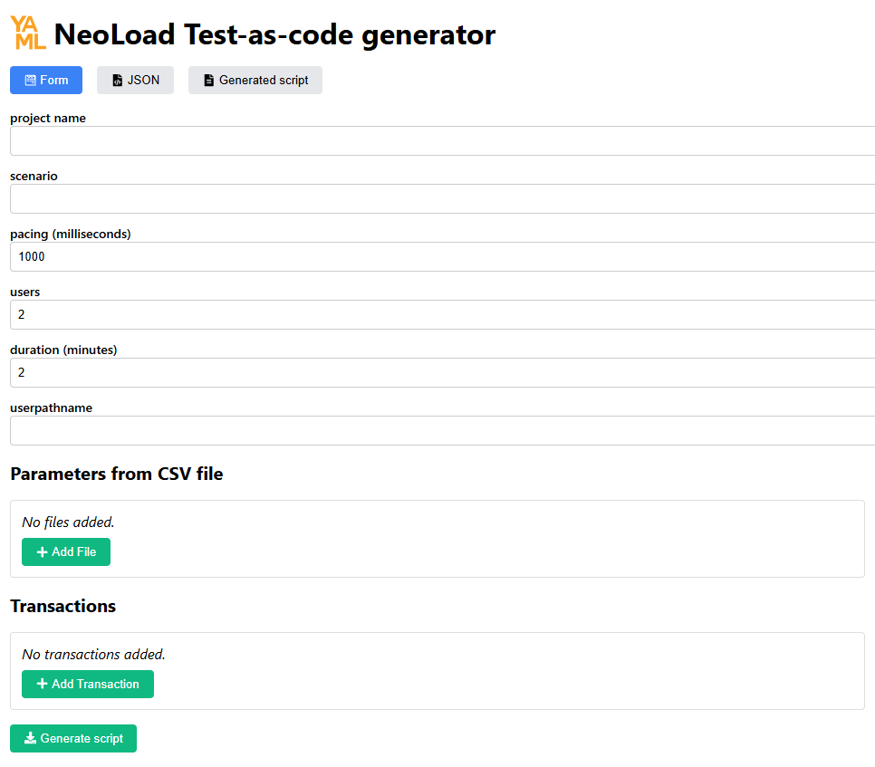

# NeoLoad Test-as-Code Generator

This is a React-based application that serves as a GUI tool for generating NeoLoad Test-as-Code scripts. It allows users to create, edit, and manage HTTP transactions, headers, extractors, and file-based parameters, and ultimately generate a YAML configuration for NeoLoad.

---

## Features

- **HTTP Request Parsing:** Convert raw HTTP request text into a structured object.
- **Transaction Management:** Add, update, and remove transactions with fields such as name, URL, method, body, and assertion.
- **Dynamic Headers & Extractors:** Easily manage headers and extractors for each transaction.
- **File Parameter Support:** Handle CSV file parameters by specifying column names and file paths.
- **JSON & YAML Integration:** View and edit form data as JSON and generate a YAML script.
- **Script Download:** Save the generated YAML configuration as a file.

---



---

## Code Overview

The application is structured into several key components:

### 1. `parseHTTPRequest(text)`
- **Purpose:** Converts a raw HTTP request string into an object with properties like method, URL, headers, and body.
- **Process:**  
  - Splits the input text into lines.
  - Extracts the request line (method, URI).
  - Parses headers until a blank line is encountered.
  - Joins the remaining lines as the request body.
  - Constructs a complete URL using the `Host` header (if present).

### 2. `HeaderRow`
- **Purpose:** Renders an individual header input row.
- **Features:**  
  - Editable fields for header name and value.
  - Button to remove the header.

### 3. `FileRow`
- **Purpose:** Displays and manages file parameter inputs.
- **Features:**  
  - Input for parameter name, CSV column names, and filename.
  - Displays generated parameter usage (e.g., `${parameter.column}`).

### 4. `TransactionRow`
- **Purpose:** Represents a single transaction in the form.
- **Features:**  
  - Fields for transaction name, URL, assertion, HTTP method, and body.
  - Import functionality to convert a raw HTTP request into a transaction.
  - Management of headers and extractors with options to add or remove them.
  - Dynamic UI elements based on the transaction method (e.g., showing the body field for POST, PUT, PATCH).

### 5. `App`
- **Purpose:** Main component that integrates all parts of the application.
- **Features:**  
  - Manages overall form data, including transactions and file parameters.
  - Supports tab switching between Form, JSON, and Generated Script views.
  - Handles form submission, YAML generation via a backend endpoint, and script download.
  - Applies JSON changes back into the form for a seamless editing experience.

---

## Installation

To install and run the application with npm, follow these steps:

1. **Clone the Repository:**

   ```bash
   git clone https://github.com/yourusername/neoload-test-as-code-generator.git
   cd neoload-test-as-code-generator
   
   
## Install Dependencies:

Ensure you have Node.js installed, then run:

   ```bash
npm install
npm start

